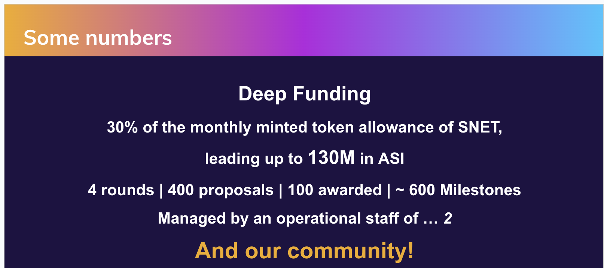
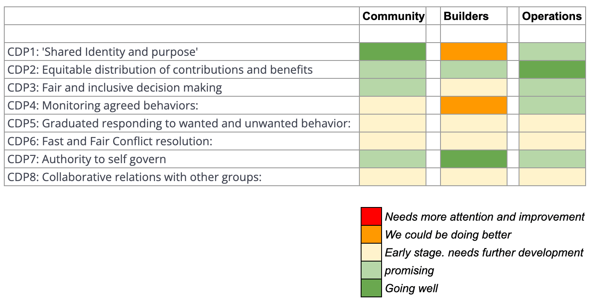
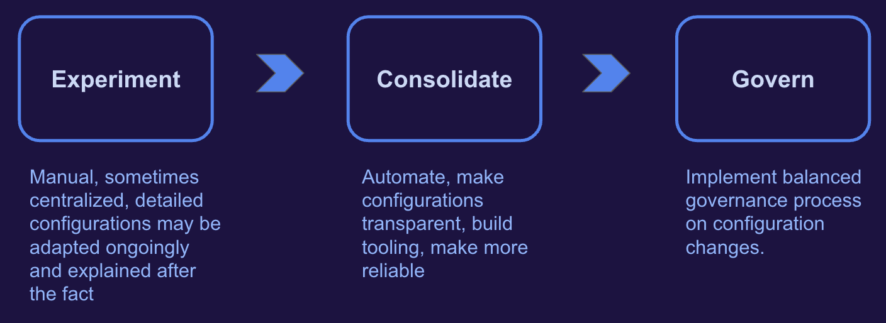

## Purpose and Goals

The **main purpose** of Deep Funding is the same as that of the SingularityNET Foundation: driving the development of a democratic, inclusive **Beneficial Artificial General Intelligence**.

## Strategic Goals

- **Our First Strategic Goal:** Help Grow The Decentralized AI Platform
- **Our Second Strategic Goal:** Creating A Community Of Builders

More info about these goals can be found in this blog:  [Funding With Purpose – Growth Strategy](https://deepfunding.ai/funding-with-purpose-growth-strategy/){ data-preview }

### Other General Sources of Information

- https://deepfunding.ai
- http://community.deepfunding.ai
- Gitbook *(working on detailed process descriptions and manuals)*

# Strategy

For a global overview of the strategy, refer to the 2 most recent decks:

- Latest internal **strategy deck**: [DF vision June 2024](https://docs.google.com/presentation/d/1m7ZXlTTEbkEtHdfmSgBuPF9322nCVDGx6ggi9HwL6KE/edit#slide=id.g22e694f469c_0_203){ data-preview }
- External version (**ASI kickoff event deck**): [Presentation ASI](https://docs.google.com/presentation/d/12Q1Sm_DQy6NyzsFs8B-VfW_o_iA9wbKs65mdBZO5fOQ/edit#slide=id.g2e7afe650d5_0_143){ data-preview }

# Culture

Building a culture is crucial in a decentralized organization made up of semi-volunteers with diverse motivations and backgrounds. We aim to be transparent, inclusive, and fair. A good guideline is offered by the **8 CDPs or **Core Design Principles** defined by Elinor Ostrom**. More information on these CDPs and an analysis of DF's maturity in each can be found in this blog:  
[Scaling For Success – Operations Strategy 2024](https://deepfunding.ai/scaling-for-success-operations-strategy-2024/){ data-preview } *(published on the last day of 2023)*

*A visual representation of this analysis.*

# Experiments and Consolidation

We nurture an experimental mindset and are constantly innovating. Examples include:

- Voting weight calculated by the square root of balances
- Voting weight increased by reputation ratings
- Governance rounds for proposing and voting on changes in rules and processes
- Multiple variations in pools
- Adding RFPs in Round 3
- Experiments in rewards for contributions
- Transitioning from a third-party solution to an in-house built proposal portal
- Developing a ‘Circle’-based organization
- Etc.

However, we aim to consolidate our gains. For example, reputation ratings started as a simple spreadsheet in the experimental phase. We have since built a platform with enhanced automation and sophistication (*consolidation*). A **Data Analytics Circle** is being established to analyze reputation calculations and advise on adjustments to algorithms, configurations, and relative weights, moving us toward the ‘Govern’ phase.

